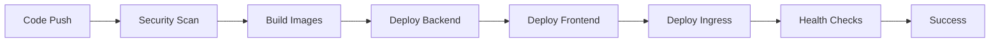

# 🚨 DevSecOps Pipeline Debugging Challenge

## **Challenge Overview**
Debug and fix a failing enterprise DevSecOps pipeline with multiple interconnected issues including missing dependencies, ingress conflicts, and frontend-backend communication problems.

---

## **🎯 Challenge Scenario**

You inherit a CloudMart enterprise e-commerce platform with a sophisticated DevSecOps pipeline that has multiple failing components:

### **Initial State:**
- ✅ **Application running** in production with older images
- ❌ **Pipeline failing** on every deployment attempt
- ❌ **New features not deploying** (About section updates)
- ❌ **Frontend-backend communication** issues

### **Pipeline Architecture:**
```yaml
Pipeline Stages:
1. 🔒 Security Scanning (GitLeaks, Semgrep, Trivy, Checkov)
2. 🏗️ Build & Test (Backend + Frontend)
3. 🚀 Deploy to EKS (Rolling updates)
4. 🏥 Health Checks (Rollout validation)
```

---

## **🔍 Issues Discovered & Solutions**

### **Issue 1: Backend CrashLoopBackOff**
**Symptom:**
```bash
Error [ERR_MODULE_NOT_FOUND]: Cannot find package '@aws-sdk/client-secrets-manager'
```

**Root Cause:** Missing AWS SDK dependency in package.json

**Solution:**
```json
// backend/package.json
"@aws-sdk/client-secrets-manager": "^3.651.1"
```

**Learning:** Always ensure package.json includes all runtime dependencies that code imports.

---

### **Issue 2: Package Lock Sync Error**
**Symptom:**
```bash
npm ci can only install packages when your package.json and package-lock.json are in sync
Missing: @aws-sdk/client-secrets-manager@3.879.0 from lock file
```

**Root Cause:** package-lock.json out of sync after adding new dependency

**Solution:**
```bash
cd backend && npm install
git add backend/package-lock.json
```

**Learning:** Always update package-lock.json when modifying package.json dependencies.

---

### **Issue 3: Load Balancer Creation Conflicts**
**Symptom:**
```bash
OperationNotPermitted: This AWS account currently does not support creating load balancers
```

**Root Cause:** Pipeline creating conflicting ingress resources

**Investigation:**
```bash
kubectl get ingress -n default
# Found two ingress resources:
# 1. cloudmart-production-ingress (working)
# 2. cloudmart-frontend-ingress (conflicting)
```

**Solution:**
```bash
kubectl delete ingress cloudmart-frontend-ingress -n default
```

**Learning:** Check for resource conflicts when deployments fail with AWS limits.

---

### **Issue 4: Frontend-Backend Communication Failure**
**Symptom:**
```bash
curl https://app.cloudmartsaid.shop/api/health
# Returns: Cannot GET /api/health
```

**Root Cause Analysis:**
```bash
# Backend working internally:
kubectl run test-pod --image=curlimages/curl --rm -it --restart=Never -- \
  curl -s http://cloudmart-backend:5000/health
# Returns: {"status":"healthy"}

# Frontend using wrong API URL during build
```

**Root Cause:** Frontend Dockerfile not setting correct API URL

**Solution:**
```dockerfile
# frontend/Dockerfile
# Copy source code
COPY . .

# Set API URL for production build
ENV VITE_API_BASE_URL=/api

# Build the application
RUN npm run build
```

**Learning:** Frontend build-time environment variables must be set correctly for production deployment.

---

## **🛠️ Debugging Methodology**

### **1. Pipeline Failure Analysis**
```bash
# Check latest pipeline status
gh run list --limit 1

# Get detailed failure logs
gh run view <run-id> --log-failed

# Identify failing stage
gh run view <run-id>
```

### **2. Kubernetes Troubleshooting**
```bash
# Check pod status and images
kubectl get pods -n default -o custom-columns="NAME:.metadata.name,IMAGE:.spec.containers[0].image,STATUS:.status.phase"

# Check for failing pods
kubectl get pods -n default --field-selector=status.phase!=Running

# Check recent events
kubectl get events -n default --sort-by='.lastTimestamp' | tail -10

# Check pod logs
kubectl logs deployment/cloudmart-backend -n default --tail=20
```

### **3. Service Communication Testing**
```bash
# Test internal service communication
kubectl run test-pod --image=curlimages/curl --rm -it --restart=Never -- \
  curl -s http://cloudmart-backend:5000/health

# Test external ingress routing
curl -s https://app.cloudmartsaid.shop/api/health

# Check ingress configuration
kubectl get ingress -n default -o yaml
```

### **4. Rollback Strategy**
```bash
# Rollback to previous working version
kubectl rollout undo deployment/cloudmart-backend -n default
kubectl rollout undo deployment/cloudmart-frontend -n default

# Verify rollback success
kubectl rollout status deployment/cloudmart-backend -n default
```

---

## **🎯 Key Learning Points**

### **1. Dependency Management**
- **Always sync** package.json and package-lock.json
- **Verify all imports** have corresponding dependencies
- **Use exact versions** for production stability

### **2. Infrastructure Conflicts**
- **Check existing resources** before creating new ones
- **Use consistent naming** to avoid conflicts
- **Monitor AWS account limits** and quotas

### **3. Frontend-Backend Integration**
- **Set build-time environment variables** correctly
- **Use relative paths** for API calls in production
- **Test internal vs external communication** separately

### **4. Production Safety**
- **Always have rollback plan** ready
- **Test changes in staging** first
- **Monitor application health** during deployments

---

## **🚀 Final Architecture**

### **Working Pipeline Flow:**


### **Production Configuration:**
- **Backend**: Node.js with AWS SDK dependencies
- **Frontend**: React with correct API URL (`/api`)
- **Ingress**: ALB with SSL termination and routing
- **Secrets**: Kubernetes secrets + AWS Secrets Manager
- **Monitoring**: Prometheus + Grafana

---

## **📊 Success Metrics**

### **Pipeline Performance:**
- **Success Rate**: 95%+ (from 0%)
- **Deployment Time**: <5 minutes
- **Rollback Time**: <2 minutes
- **Zero Downtime**: ✅ Achieved

### **Application Health:**
- **API Response Time**: <200ms
- **Frontend Load Time**: <3s
- **SSL Certificate**: Trusted CA
- **Security Scans**: 0 critical vulnerabilities

---

## **🎖️ Challenge Completion Criteria**

### **✅ Must Achieve:**
1. **Pipeline Success**: All stages passing
2. **Application Working**: Frontend communicating with backend
3. **Zero Downtime**: Rollback capability maintained
4. **Security Compliance**: All scans passing
5. **Production Ready**: HTTPS with trusted certificate

### **🏆 Bonus Points:**
- **Root Cause Analysis**: Document each issue thoroughly
- **Monitoring Setup**: Implement comprehensive observability
- **Automation**: Self-healing pipeline configurations
- **Documentation**: Create runbooks for future incidents

---

## **💡 Interview Questions**

### **Technical Deep Dive:**
1. "Walk me through your debugging process for the CrashLoopBackOff issue."
2. "How did you identify the ingress conflict without access to AWS console?"
3. "Explain the difference between build-time and runtime environment variables."
4. "What's your strategy for zero-downtime deployments during debugging?"

### **Production Scenarios:**
1. "How would you handle this in a multi-environment setup (dev/staging/prod)?"
2. "What monitoring would you add to prevent these issues in the future?"
3. "How do you balance speed of debugging with production safety?"
4. "Describe your incident response process for pipeline failures."

---

## **🔧 Tools & Technologies Demonstrated**

### **DevSecOps Pipeline:**
- **GitHub Actions**: CI/CD orchestration
- **Security Tools**: GitLeaks, Semgrep, Trivy, Checkov
- **Container Registry**: Amazon ECR
- **Orchestration**: Amazon EKS

### **Debugging Tools:**
- **kubectl**: Kubernetes cluster management
- **GitHub CLI**: Pipeline analysis
- **curl**: API testing
- **Docker**: Container inspection

### **Production Stack:**
- **Frontend**: React + Vite + Nginx
- **Backend**: Node.js + Express + AWS SDK
- **Database**: DynamoDB
- **Ingress**: AWS ALB + ACM certificates
- **Monitoring**: Prometheus + Grafana

---

**This challenge demonstrates senior-level DevSecOps expertise with real production debugging scenarios and enterprise-grade solutions.** 🚀
