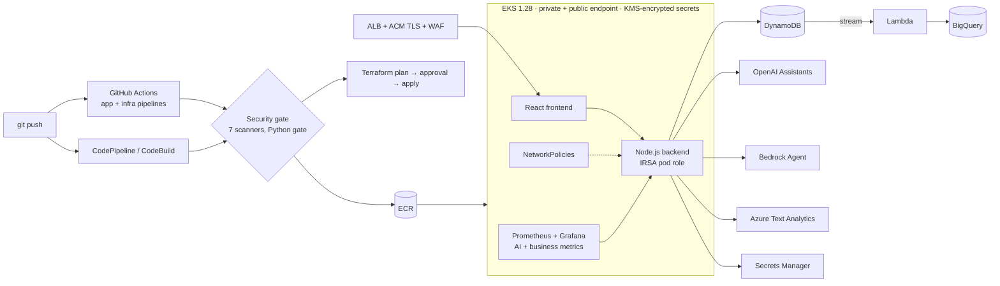
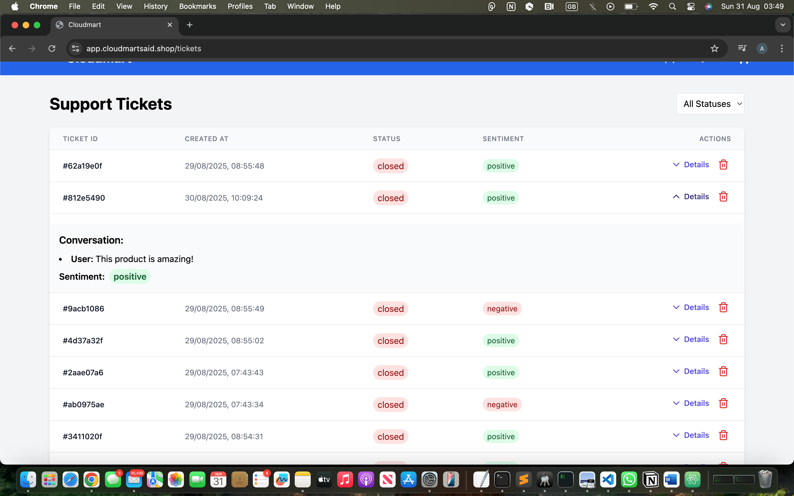

# CloudMart: Multi-Cloud AI E-Commerce on AWS EKS

An e-commerce app on **Amazon EKS** with AI features from three clouds: an OpenAI assistant, an Amazon Bedrock agent, and Azure sentiment analysis on support tickets. Orders stream from DynamoDB to Google BigQuery for analytics. Everything is provisioned with Terraform and shipped through security-gated CI/CD.

> **Portfolio build, decommissioned.** The application and base architecture come from the public **Multicloud DevOps & AI Challenge** (reference diagram below). I built and ran it in my own AWS, Azure and GCP accounts in August–September 2025, then extended it with the DevSecOps pipelines, security controls and observability described here. It was never used by real customers. The dashboard traffic came from a load-generator script, and the infrastructure has since been torn down.


---

## 1. Problem

A typical product team wants AI features (a shopping assistant, ticket triage, analytics) without running models itself, and without giving up control of security and cost. This project answers: what does it take to run a containerised app on EKS that calls AI services across three clouds, and keep every change scanned, every secret out of the repo, and every AI call measurable?

## 2. Architecture

**Challenge reference architecture** (the starting point):


**What I added on top:**


```mermaid
flowchart LR
  Dev[git push] --> GA[GitHub Actions<br/>app + infra pipelines]
  Dev --> CP[CodePipeline / CodeBuild]
  GA --> SEC{Security gate<br/>7 scanners, Python gate}
  CP --> SEC
  SEC --> ECR[(ECR)]
  SEC --> TF[Terraform plan → approval → apply]
  ECR --> EKS
  subgraph EKS["EKS 1.28 · private + public endpoint · KMS-encrypted secrets"]
    FE[React frontend] --> BE[Node.js backend<br/>IRSA pod role]
    NP[NetworkPolicies] -.-> BE
    PR[Prometheus + Grafana<br/>AI + business metrics] --> BE
  end
  ALB[ALB + ACM TLS + WAF] --> FE
  BE --> DDB[(DynamoDB)] -->|stream| L[Lambda] --> BQ[(BigQuery)]
  BE --> OAI[OpenAI Assistants] & BR[Bedrock Agent] & AZ[Azure Text Analytics]
  BE --> SM[Secrets Manager]
```

| Area | Where |
|---|---|
| Terraform (15 modules, 9 wired into the root) | `terraform/modules/`: eks (incl. VPC), dynamodb, lambda, acm, waf, azure, gcp, cicd, iac-cicd are composed in `terraform/main.tf`; networking, ecr, database, security, monitoring, observability are standalone |
| App | `backend/` (Node.js/Express), `frontend/` (React/Vite), `backend/src/lambda/` |
| Kubernetes | `k8s/base`, `k8s/environments/{development,staging,production}`, `k8s/infrastructure` (ALB controller SA, NetworkPolicies, WAF) |
| Pipelines | `.github/workflows/devsecops-{application,infrastructure}.yml`, `ci-cd/buildspecs/*.yml` |
| Security | `ci-cd/buildspecs/buildspec-security.yml`, `security/falco-rules.yaml`, `security/k8s/`, `config/.checkov.yml`, `.tfsec.yml`, `.semgrepignore` |
| Observability | `k8s/observability/` (Prometheus, Grafana, node-exporter, CloudWatch exporter), `backend/src/middleware/metrics.js`, `monitoring/*.json` dashboards |

## 3. Key decisions and trade-offs

- **The security gate is code, not a checklist.** In the CodePipeline path, `buildspec-security.yml` runs 7 scanners: gitleaks, Semgrep, Bandit, npm audit/retire.js, Safety, Checkov and Trivy. A Python step parses their JSON and fails the build on leaked secrets, Semgrep errors or CRITICAL image CVEs. Bandit, npm audit and Safety are report-only. (The GitHub Actions path runs similar scans, but its image scans only report.)
- **Pods get AWS access through IRSA, not node roles.** The backend's service account assumes its own IAM role, and third-party API keys live in Secrets Manager. (The role itself is too broad; see limitations.)
- **EKS hardening basics:** secrets are envelope-encrypted with a KMS key, all five control-plane log types are enabled, the private endpoint is on, and the EBS CSI driver runs with its own IRSA role.
- **Edge:** ALB with an ACM certificate and a WAF web ACL in front of the frontend.
- **Infrastructure changes need a human.** The Terraform CodePipeline runs validate → plan (with an Infracost cost estimate) → **manual approval** → apply → notify, with the state backed up to S3 before each apply.
- **Event-driven analytics instead of querying the app database.** A DynamoDB stream triggers a Lambda that writes orders to BigQuery, so analytics never touches the transactional table.
- **AI calls are instrumented like any dependency.** Request count, latency and estimated cost per AI provider are exported as Prometheus metrics and graphed in Grafana.

## 4. Known limitations / what I'd do next

The application code came from the challenge and was built as a demo, so it has no real user security. I'm listing it plainly because these are exactly the problems I'd look for in a client's system.

**Fixed since the first deploy**

- **The AI assistant can no longer delete orders, or touch anyone else's.** Originally the assistant exposed a `delete_order` tool to OpenAI with no ownership check, so a chat message could delete someone else's order. Now:
  - The model is offered one tool, `cancel_order`. Cancelling is a reversible status change.
  - Every tool call goes through `backend/src/services/orderTools.js` before anything happens. It rejects unknown tools, including `delete_order`, and malformed order IDs.
  - It only acts on orders owned by the customer on the conversation. That email is passed in by the caller, never taken from the model.
  - It only cancels orders that are still `pending` or `processing`.
  - "Not found" and "not yours" return the same answer, so the tool can't be used to discover which order IDs exist.
  - `orderTools.test.js` covers all of this (`npm test`, Node's built-in runner).

  *LLMs can draft; deterministic controls decide.*

  One caveat: the customer's email is only as trustworthy as the caller until the API has real authentication (see the next item). With a JWT, it would come from the token's claims instead of the request body.

**Still open**

- **The API has no authentication.** Anyone can list all orders, and create, edit or delete products, orders and tickets. The `/admin` page is open. Next: Cognito (or another OIDC provider) with JWT checks on every route, and role-based access for admin.
- **The pod IAM role is too broad.** IRSA is used correctly, but the role attaches `AmazonDynamoDBFullAccess`, `SecretsManagerReadWrite` and `AmazonBedrockFullAccess`. Next: a custom policy limited to the three tables, one secret path and one Bedrock agent.
- **The infrastructure pipeline's CodeBuild role has `Action: *` on `Resource: *`.** Next: a scoped deploy role with a permissions boundary.
- **The IaC scan gate barely gates.** About 50 Checkov checks are skipped for the demo, both Checkov and tfsec run in soft-fail mode in GitHub Actions, and the CodeBuild gate filters on a severity field that open-source Checkov leaves empty without a platform API key. Next: fail on specific check IDs instead of severity.

- **The EKS public endpoint is open** (`endpoint_public_access = true` with no CIDR restriction). Next: restrict it to CI/admin CIDRs, or use private-only access with a bastion/SSM.
- **CI uses long-lived AWS access keys.** Next: GitHub OIDC with per-pipeline roles.
- **Scanner installs pipe remote scripts from `main` into bash** (Trivy, gitleaks). Next: pin versions and verify checksums, since the pipeline is itself supply-chain surface.
- **The EKS addon uses the deprecated `resolve_conflicts`**, and the cluster version (1.28) is out of standard support. Next: move to `resolve_conflicts_on_*` and upgrade.
- **The security gate fails open.** If a scanner crashes and writes no report, the Python gate counts it as a pass. Next: treat a missing report as a failure.
- **Prometheus and Grafana were exposed on the internet.** Prometheus ran with its admin API enabled, and the backend's service account could read every Secret in the cluster. Next: internal-only monitoring (or SSO in front), admin API off, and a namespaced Role limited to the secrets it needs.
- **A long-lived GCP service-account key** is created by Terraform and stored in Secrets Manager for the BigQuery Lambda. Next: GCP Workload Identity Federation with AWS, so no key exists.
- **A Grafana admin password was committed** in an early version (since removed from the code). Always create that secret out of band.
- **Two NetworkPolicy files overlap** (`k8s/infrastructure/` and `security/k8s/`), and the PodSecurityPolicy manifest targets an API removed in Kubernetes 1.25. Next: consolidate, and move to Pod Security Admission.
- **The Grafana/Prometheus stack runs as plain manifests.** Next: kube-prometheus-stack via Helm/ArgoCD for upgrades and HA.
- **The last CI runs failed** (Sept 2025) after the infrastructure was removed; the earlier successful run is shown below.

## 5. Evidence

| | |
|---|---|
|  | Application pipeline run #21: security scanning → build & test → deploy to EKS → summary report, all green |
|  | ALB target groups healthy |
|  | Orders arriving in BigQuery through the DynamoDB stream → Lambda path |
|  | Azure sentiment analysis on support tickets |

## 6. Run it yourself

Prerequisites: AWS account, Azure subscription (Text Analytics), GCP project (BigQuery), OpenAI API key and assistant, Bedrock agent, Terraform ≥ 1.5, kubectl, Docker.

```bash
cp terraform/terraform.tfvars.example terraform/terraform.tfvars   # fill in your values
cd terraform
terraform init      # edit the S3 backend block in main.tf to your own state bucket first
terraform plan && terraform apply

aws eks update-kubeconfig --name <cluster-name> --region us-east-1
# Replace <AWS_ACCOUNT_ID> placeholders in k8s/ with your account, then:
kubectl apply -f k8s/infrastructure/ -f k8s/base/ -f k8s/observability/
```

**Cost:** roughly **$250–350/month** while running in us-east-1. The main costs are the EKS control plane (~$73), 2× t3.medium nodes, NAT gateway, ALB and WAF, plus usage-based AI API calls. **Run `terraform destroy` when you're done.**

---

**Abdihakim Said**, AWS Solutions Architect Associate · CKA. I build secure delivery pipelines and Kubernetes platforms on AWS. Contact details are on my [GitHub profile](https://github.com/abdihakim-said).
