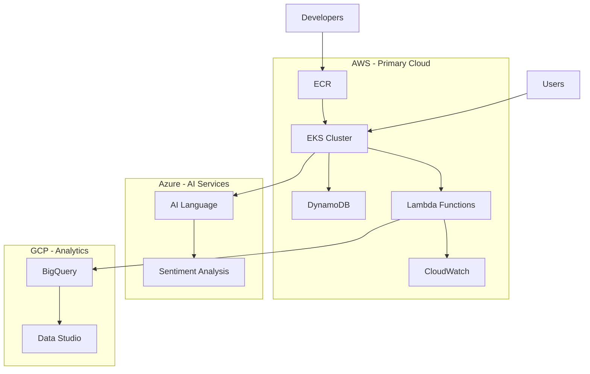

# ADR-001: Multi-Cloud Architecture Strategy

## Status
**Accepted** - 2025-08-27

## Context
CloudMart requires a scalable, resilient, and cost-effective infrastructure to support:
- High-availability e-commerce operations
- AI-powered customer support
- Real-time analytics and reporting
- Global user base with low latency requirements
- Disaster recovery and business continuity

## Decision
We will implement a **multi-cloud architecture** using AWS as the primary cloud provider, with Azure and GCP for specialized services:

### Primary Cloud: AWS
- **Compute**: Amazon EKS for container orchestration
- **Database**: DynamoDB for NoSQL data storage
- **Serverless**: Lambda functions for event processing
- **AI/ML**: AWS Bedrock for enterprise AI models
- **Monitoring**: CloudWatch for native AWS monitoring

### Secondary Clouds:
- **Azure**: AI Language services for sentiment analysis
- **GCP**: BigQuery for data analytics and reporting

## Rationale

### Advantages
1. **Best-of-Breed Services**: Leverage each cloud's strengths
   - AWS: Mature ecosystem, extensive services
   - Azure: Advanced AI/ML capabilities
   - GCP: Superior data analytics platform

2. **Vendor Lock-in Mitigation**: Reduce dependency on single provider
3. **Cost Optimization**: Competitive pricing across providers
4. **Disaster Recovery**: Cross-cloud redundancy
5. **Compliance**: Meet regional data residency requirements

### Technical Benefits
- **Performance**: Use geographically distributed services
- **Scalability**: Leverage multiple cloud scaling capabilities
- **Innovation**: Access to latest cloud-native technologies
- **Resilience**: Fault tolerance across cloud providers

## Implementation Strategy

### Phase 1: AWS Foundation
```yaml
Core Infrastructure:
  - VPC with public/private subnets
  - EKS cluster with managed node groups
  - DynamoDB tables with global tables
  - Lambda functions for data processing
  - ECR for container image management
```

### Phase 2: Multi-Cloud Integration
```yaml
Azure Integration:
  - AI Language services via REST APIs
  - Azure Key Vault for secrets (future)
  - Azure Monitor integration (future)

GCP Integration:
  - BigQuery for analytics pipeline
  - Cloud Storage for data lake (future)
  - Cloud Functions for data processing (future)
```

### Phase 3: Advanced Features
```yaml
Advanced Capabilities:
  - Cross-cloud networking (VPN/peering)
  - Multi-cloud disaster recovery
  - Global load balancing
  - Cross-cloud cost optimization
```

## Architecture Diagram



## Consequences

### Positive
- ✅ **Flexibility**: Choose best services from each provider
- ✅ **Resilience**: Reduced single point of failure
- ✅ **Cost Optimization**: Competitive pricing leverage
- ✅ **Innovation**: Access to cutting-edge technologies
- ✅ **Compliance**: Meet diverse regulatory requirements

### Negative
- ❌ **Complexity**: Increased operational overhead
- ❌ **Skills**: Team needs multi-cloud expertise
- ❌ **Networking**: Cross-cloud connectivity challenges
- ❌ **Monitoring**: Unified observability complexity
- ❌ **Cost Management**: Multi-cloud billing complexity

### Mitigation Strategies
1. **Standardization**: Use Infrastructure as Code (Terraform)
2. **Training**: Invest in team multi-cloud skills
3. **Tooling**: Implement unified monitoring and cost management
4. **Documentation**: Maintain comprehensive operational guides
5. **Automation**: Reduce manual operations through CI/CD

## Alternatives Considered

### Single Cloud (AWS Only)
- **Pros**: Simpler operations, unified billing, single skill set
- **Cons**: Vendor lock-in, limited innovation, single point of failure
- **Decision**: Rejected due to vendor lock-in concerns

### Hybrid Cloud (On-premises + Cloud)
- **Pros**: Data control, compliance, gradual migration
- **Cons**: Infrastructure complexity, maintenance overhead
- **Decision**: Rejected due to operational complexity

### Multi-Cloud with Equal Distribution
- **Pros**: Maximum vendor independence
- **Cons**: Extreme complexity, cost inefficiency
- **Decision**: Rejected due to operational overhead

## Success Metrics

### Technical Metrics
- **Availability**: 99.9% uptime across all services
- **Performance**: <200ms API response time globally
- **Scalability**: Handle 10x traffic spikes automatically
- **Recovery**: <5 minutes RTO, <1 hour RPO

### Business Metrics
- **Cost**: 30% reduction vs single-cloud approach
- **Innovation**: 50% faster feature delivery
- **Compliance**: 100% regulatory requirement coverage
- **Risk**: 90% reduction in vendor lock-in risk

## Implementation Timeline

### Q1 2025: Foundation
- ✅ AWS infrastructure deployment
- ✅ Basic multi-cloud connectivity
- ✅ Initial monitoring setup

### Q2 2025: Integration
- 🔄 Azure AI services integration
- 🔄 GCP BigQuery pipeline
- 🔄 Cross-cloud security implementation

### Q3 2025: Optimization
- 📅 Performance optimization
- 📅 Cost optimization implementation
- 📅 Advanced monitoring setup

### Q4 2025: Advanced Features
- 📅 Disaster recovery testing
- 📅 Global load balancing
- 📅 Advanced analytics platform

## Related ADRs
- ADR-002: Container Orchestration Platform Selection
- ADR-003: Database Strategy and Data Management
- ADR-004: Security Framework and DevSecOps Implementation
- ADR-005: Observability and Monitoring Strategy

## References
- [AWS Well-Architected Framework](https://aws.amazon.com/architecture/well-architected/)
- [Azure Architecture Center](https://docs.microsoft.com/en-us/azure/architecture/)
- [Google Cloud Architecture Framework](https://cloud.google.com/architecture/framework)
- [Multi-Cloud Best Practices](https://www.cncf.io/blog/2021/03/11/multi-cloud-best-practices/)

---

**Author**: Abdihakim Said - Senior DevOps Engineer  
**Reviewers**: DevOps Team, Security Team, Architecture Review Board  
**Last Updated**: 2025-08-27
