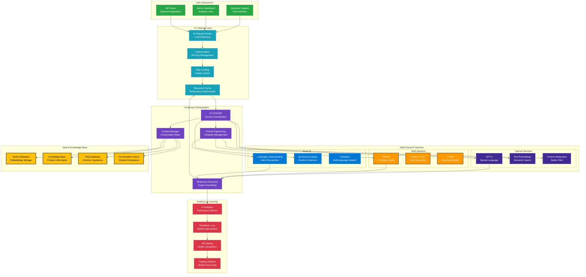
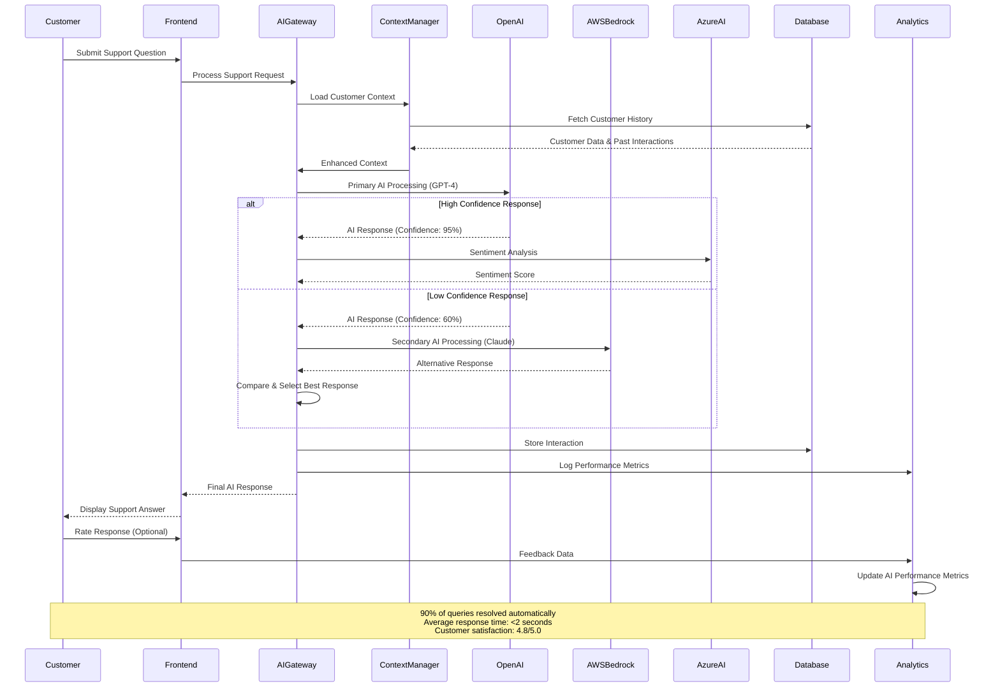
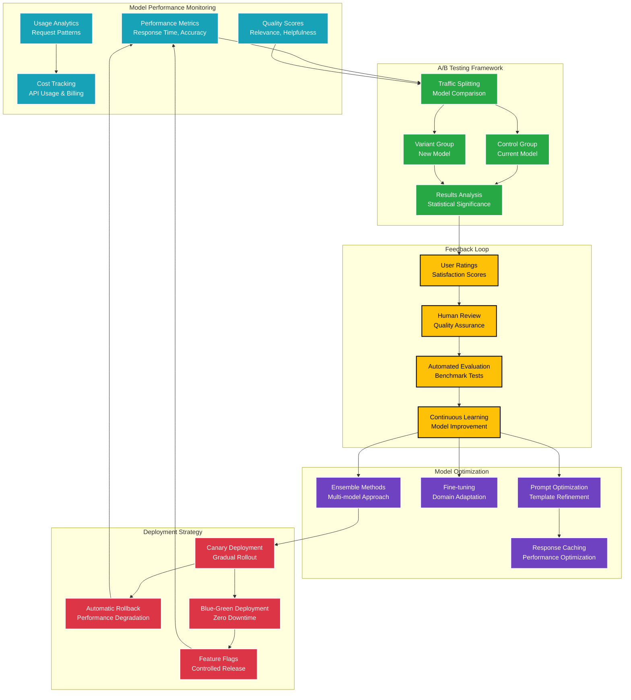

# CloudMart AI Integration & Data Flow

## 🤖 **AI Services Architecture**

```mermaid
graph TB
    subgraph "User Interactions"
        CUSTOMER[Customer Support<br/>Chat Interface]
        ADMIN[Admin Dashboard<br/>Analytics View]
        API_USER[API Users<br/>External Integrations]
    end

    subgraph "AI Gateway Layer"
        AI_ROUTER[AI Request Router<br/>Load Balancing]
        AUTH[Authentication<br/>API Key Management]
        RATE_LIMIT[Rate Limiting<br/>Usage Control]
        CACHE[Response Cache<br/>Performance Optimization]
    end

    subgraph "AI Service Orchestration"
        AI_CONTROLLER[AI Controller<br/>Service Coordination]
        CONTEXT_MGR[Context Manager<br/>Conversation State]
        PROMPT_ENG[Prompt Engineering<br/>Template Management]
        RESPONSE_PROC[Response Processor<br/>Output Formatting]
    end

    subgraph "Multi-Cloud AI Services"
        subgraph "OpenAI Services"
            GPT4[GPT-4<br/>Natural Language]
            EMBEDDINGS[Text Embeddings<br/>Semantic Search]
            MODERATION[Content Moderation<br/>Safety Filter]
        end
        
        subgraph "AWS Bedrock"
            CLAUDE[Claude<br/>Anthropic Model]
            TITAN[Amazon Titan<br/>Text Generation]
            COHERE[Cohere<br/>Command Model]
        end
        
        subgraph "Azure AI"
            LANGUAGE[Language Understanding<br/>Intent Recognition]
            SENTIMENT[Sentiment Analysis<br/>Emotion Detection]
            TRANSLATOR[Translator<br/>Multi-language Support]
        end
    end

    subgraph "Data & Knowledge Base"
        VECTOR_DB[Vector Database<br/>Embeddings Storage]
        KNOWLEDGE[Knowledge Base<br/>Product Information]
        FAQ[FAQ Database<br/>Common Questions]
        HISTORY[Conversation History<br/>Context Persistence]
    end

    subgraph "Analytics & Learning"
        ANALYTICS[AI Analytics<br/>Performance Metrics]
        FEEDBACK[Feedback Loop<br/>Model Improvement]
        A_B_TEST[A/B Testing<br/>Model Comparison]
        TRAINING[Training Pipeline<br/>Model Fine-tuning]
    end

    %% User Flow
    CUSTOMER --> AI_ROUTER
    ADMIN --> AI_ROUTER
    API_USER --> AI_ROUTER

    %% Gateway Processing
    AI_ROUTER --> AUTH
    AUTH --> RATE_LIMIT
    RATE_LIMIT --> CACHE
    CACHE --> AI_CONTROLLER

    %% AI Processing
    AI_CONTROLLER --> CONTEXT_MGR
    AI_CONTROLLER --> PROMPT_ENG
    PROMPT_ENG --> GPT4
    PROMPT_ENG --> CLAUDE
    PROMPT_ENG --> LANGUAGE

    %% Specialized Services
    AI_CONTROLLER --> EMBEDDINGS
    AI_CONTROLLER --> SENTIMENT
    AI_CONTROLLER --> MODERATION

    %% Response Processing
    GPT4 --> RESPONSE_PROC
    CLAUDE --> RESPONSE_PROC
    LANGUAGE --> RESPONSE_PROC
    RESPONSE_PROC --> CACHE

    %% Data Integration
    CONTEXT_MGR --> VECTOR_DB
    CONTEXT_MGR --> KNOWLEDGE
    CONTEXT_MGR --> FAQ
    CONTEXT_MGR --> HISTORY

    %% Analytics Flow
    RESPONSE_PROC --> ANALYTICS
    ANALYTICS --> FEEDBACK
    FEEDBACK --> A_B_TEST
    A_B_TEST --> TRAINING

    %% Styling
    classDef users fill:#28A745,stroke:#fff,stroke-width:2px,color:#fff
    classDef gateway fill:#17A2B8,stroke:#fff,stroke-width:2px,color:#fff
    classDef orchestration fill:#6F42C1,stroke:#fff,stroke-width:2px,color:#fff
    classDef openai fill:#412991,stroke:#fff,stroke-width:2px,color:#fff
    classDef aws fill:#FF9900,stroke:#232F3E,stroke-width:2px,color:#fff
    classDef azure fill:#0078D4,stroke:#fff,stroke-width:2px,color:#fff
    classDef data fill:#FFC107,stroke:#000,stroke-width:2px,color:#000
    classDef analytics fill:#DC3545,stroke:#fff,stroke-width:2px,color:#fff

    class CUSTOMER,ADMIN,API_USER users
    class AI_ROUTER,AUTH,RATE_LIMIT,CACHE gateway
    class AI_CONTROLLER,CONTEXT_MGR,PROMPT_ENG,RESPONSE_PROC orchestration
    class GPT4,EMBEDDINGS,MODERATION openai
    class CLAUDE,TITAN,COHERE aws
    class LANGUAGE,SENTIMENT,TRANSLATOR azure
    class VECTOR_DB,KNOWLEDGE,FAQ,HISTORY data
    class ANALYTICS,FEEDBACK,A_B_TEST,TRAINING analytics
```

## 📊 **Real-Time Data Pipeline**

```mermaid
flowchart LR
    subgraph "Data Sources"
        ORDERS[(DynamoDB<br/>Orders)]
        USERS[(DynamoDB<br/>Users)]
        PRODUCTS[(DynamoDB<br/>Products)]
        TICKETS[(DynamoDB<br/>Support Tickets)]
        LOGS[Application Logs<br/>CloudWatch]
    end

    subgraph "Stream Processing"
        STREAMS[DynamoDB Streams<br/>Change Data Capture]
        KINESIS[Kinesis Data Streams<br/>Real-time Ingestion]
        LAMBDA[Lambda Functions<br/>Stream Processing]
        SQS[SQS Queues<br/>Message Buffering]
    end

    subgraph "Data Transformation"
        ETL[ETL Pipeline<br/>Data Cleaning]
        ENRICH[Data Enrichment<br/>Context Addition]
        VALIDATE[Data Validation<br/>Quality Checks]
        FORMAT[Format Conversion<br/>Schema Mapping]
    end

    subgraph "Analytics Storage"
        BIGQUERY[(BigQuery<br/>Data Warehouse)]
        S3_LAKE[(S3 Data Lake<br/>Raw Data Storage)]
        REDIS[(Redis<br/>Real-time Cache)]
        ELASTIC[(Elasticsearch<br/>Search & Analytics)]
    end

    subgraph "Analytics & ML"
        DATASTUDIO[Data Studio<br/>Business Intelligence]
        ML_MODELS[ML Models<br/>Predictive Analytics]
        RECOMMENDATIONS[Recommendation Engine<br/>Personalization]
        ANOMALY[Anomaly Detection<br/>Fraud Prevention]
    end

    subgraph "Real-time Applications"
        DASHBOARDS[Real-time Dashboards<br/>Live Metrics]
        ALERTS[Smart Alerts<br/>Proactive Monitoring]
        PERSONALIZATION[Real-time Personalization<br/>Dynamic Content]
        INVENTORY[Inventory Management<br/>Stock Optimization]
    end

    %% Data Ingestion
    ORDERS --> STREAMS
    USERS --> STREAMS
    PRODUCTS --> STREAMS
    TICKETS --> STREAMS
    LOGS --> KINESIS

    %% Stream Processing
    STREAMS --> LAMBDA
    KINESIS --> LAMBDA
    LAMBDA --> SQS

    %% Data Transformation
    SQS --> ETL
    ETL --> ENRICH
    ENRICH --> VALIDATE
    VALIDATE --> FORMAT

    %% Storage Distribution
    FORMAT --> BIGQUERY
    FORMAT --> S3_LAKE
    FORMAT --> REDIS
    FORMAT --> ELASTIC

    %% Analytics Processing
    BIGQUERY --> DATASTUDIO
    BIGQUERY --> ML_MODELS
    S3_LAKE --> RECOMMENDATIONS
    ELASTIC --> ANOMALY

    %% Real-time Applications
    REDIS --> DASHBOARDS
    ML_MODELS --> ALERTS
    RECOMMENDATIONS --> PERSONALIZATION
    ANOMALY --> INVENTORY

    %% Styling
    classDef sources fill:#28A745,stroke:#fff,stroke-width:2px,color:#fff
    classDef streaming fill:#17A2B8,stroke:#fff,stroke-width:2px,color:#fff
    classDef transform fill:#FFC107,stroke:#000,stroke-width:2px,color:#000
    classDef storage fill:#6F42C1,stroke:#fff,stroke-width:2px,color:#fff
    classDef analytics fill:#DC3545,stroke:#fff,stroke-width:2px,color:#fff
    classDef apps fill:#FD7E14,stroke:#fff,stroke-width:2px,color:#fff

    class ORDERS,USERS,PRODUCTS,TICKETS,LOGS sources
    class STREAMS,KINESIS,LAMBDA,SQS streaming
    class ETL,ENRICH,VALIDATE,FORMAT transform
    class BIGQUERY,S3_LAKE,REDIS,ELASTIC storage
    class DATASTUDIO,ML_MODELS,RECOMMENDATIONS,ANOMALY analytics
    class DASHBOARDS,ALERTS,PERSONALIZATION,INVENTORY apps
```

## 🎯 **AI Customer Support Flow**

```mermaid
sequenceDiagram
    participant Customer
    participant Frontend
    participant AIGateway
    participant ContextManager
    participant OpenAI
    participant AWSBedrock
    participant AzureAI
    participant Database
    participant Analytics

    Customer->>Frontend: Submit Support Question
    Frontend->>AIGateway: Process Support Request
    
    AIGateway->>ContextManager: Load Customer Context
    ContextManager->>Database: Fetch Customer History
    Database-->>ContextManager: Customer Data & Past Interactions
    
    ContextManager->>AIGateway: Enhanced Context
    AIGateway->>OpenAI: Primary AI Processing (GPT-4)
    
    alt High Confidence Response
        OpenAI-->>AIGateway: AI Response (Confidence: 95%)
        AIGateway->>AzureAI: Sentiment Analysis
        AzureAI-->>AIGateway: Sentiment Score
    else Low Confidence Response
        OpenAI-->>AIGateway: AI Response (Confidence: 60%)
        AIGateway->>AWSBedrock: Secondary AI Processing (Claude)
        AWSBedrock-->>AIGateway: Alternative Response
        AIGateway->>AIGateway: Compare & Select Best Response
    end
    
    AIGateway->>Database: Store Interaction
    AIGateway->>Analytics: Log Performance Metrics
    
    AIGateway-->>Frontend: Final AI Response
    Frontend-->>Customer: Display Support Answer
    
    Customer->>Frontend: Rate Response (Optional)
    Frontend->>Analytics: Feedback Data
    Analytics->>Analytics: Update AI Performance Metrics
    
    Note over Customer,Analytics: 90% of queries resolved automatically<br/>Average response time: <2 seconds<br/>Customer satisfaction: 4.8/5.0
```

## 🔄 **AI Model Performance & Optimization**

```mermaid
graph TD
    subgraph "Model Performance Monitoring"
        METRICS[Performance Metrics<br/>Response Time, Accuracy]
        QUALITY[Quality Scores<br/>Relevance, Helpfulness]
        USAGE[Usage Analytics<br/>Request Patterns]
        COST[Cost Tracking<br/>API Usage & Billing]
    end

    subgraph "A/B Testing Framework"
        TRAFFIC_SPLIT[Traffic Splitting<br/>Model Comparison]
        CONTROL[Control Group<br/>Current Model]
        VARIANT[Variant Group<br/>New Model]
        RESULTS[Results Analysis<br/>Statistical Significance]
    end

    subgraph "Feedback Loop"
        USER_FEEDBACK[User Ratings<br/>Satisfaction Scores]
        HUMAN_REVIEW[Human Review<br/>Quality Assurance]
        AUTO_EVAL[Automated Evaluation<br/>Benchmark Tests]
        LEARNING[Continuous Learning<br/>Model Improvement]
    end

    subgraph "Model Optimization"
        PROMPT_OPT[Prompt Optimization<br/>Template Refinement]
        FINE_TUNE[Fine-tuning<br/>Domain Adaptation]
        ENSEMBLE[Ensemble Methods<br/>Multi-model Approach]
        CACHING[Response Caching<br/>Performance Optimization]
    end

    subgraph "Deployment Strategy"
        CANARY[Canary Deployment<br/>Gradual Rollout]
        ROLLBACK[Automatic Rollback<br/>Performance Degradation]
        BLUE_GREEN[Blue-Green Deployment<br/>Zero Downtime]
        FEATURE_FLAGS[Feature Flags<br/>Controlled Release]
    end

    %% Performance Monitoring Flow
    METRICS --> TRAFFIC_SPLIT
    QUALITY --> TRAFFIC_SPLIT
    USAGE --> COST

    %% A/B Testing Flow
    TRAFFIC_SPLIT --> CONTROL
    TRAFFIC_SPLIT --> VARIANT
    CONTROL --> RESULTS
    VARIANT --> RESULTS

    %% Feedback Integration
    RESULTS --> USER_FEEDBACK
    USER_FEEDBACK --> HUMAN_REVIEW
    HUMAN_REVIEW --> AUTO_EVAL
    AUTO_EVAL --> LEARNING

    %% Optimization Process
    LEARNING --> PROMPT_OPT
    LEARNING --> FINE_TUNE
    LEARNING --> ENSEMBLE
    PROMPT_OPT --> CACHING

    %% Deployment Process
    ENSEMBLE --> CANARY
    CANARY --> ROLLBACK
    CANARY --> BLUE_GREEN
    BLUE_GREEN --> FEATURE_FLAGS

    %% Continuous Improvement
    FEATURE_FLAGS --> METRICS
    ROLLBACK --> METRICS

    %% Styling
    classDef monitoring fill:#17A2B8,stroke:#fff,stroke-width:2px,color:#fff
    classDef testing fill:#28A745,stroke:#fff,stroke-width:2px,color:#fff
    classDef feedback fill:#FFC107,stroke:#000,stroke-width:2px,color:#000
    classDef optimization fill:#6F42C1,stroke:#fff,stroke-width:2px,color:#fff
    classDef deployment fill:#DC3545,stroke:#fff,stroke-width:2px,color:#fff

    class METRICS,QUALITY,USAGE,COST monitoring
    class TRAFFIC_SPLIT,CONTROL,VARIANT,RESULTS testing
    class USER_FEEDBACK,HUMAN_REVIEW,AUTO_EVAL,LEARNING feedback
    class PROMPT_OPT,FINE_TUNE,ENSEMBLE,CACHING optimization
    class CANARY,ROLLBACK,BLUE_GREEN,FEATURE_FLAGS deployment
```
