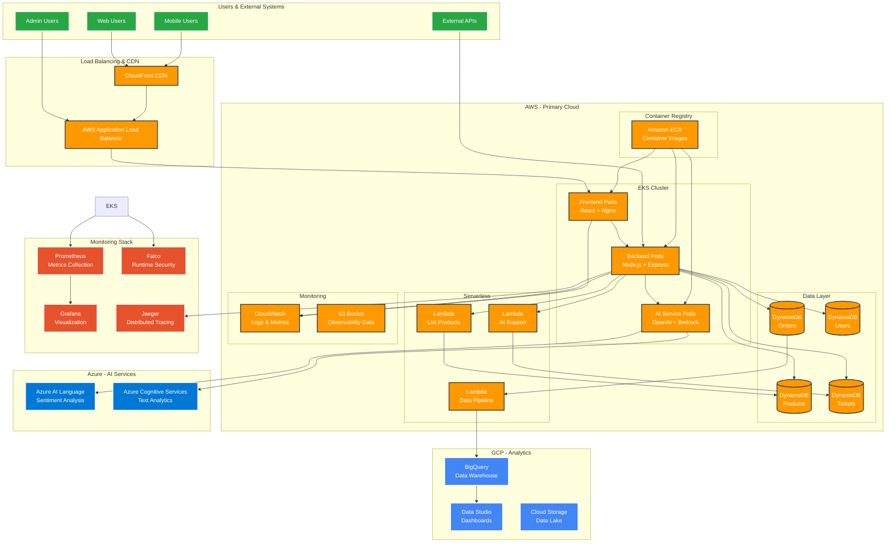
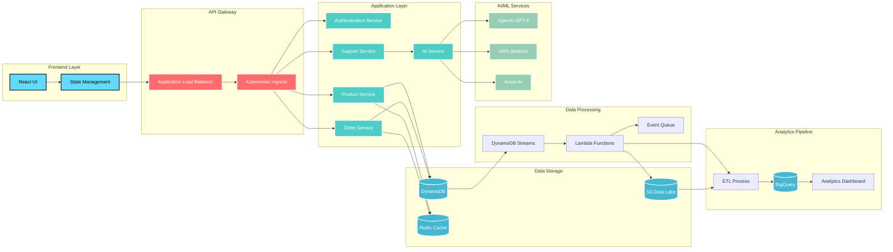

# CloudMart Architecture Overview

## 🏗️ **High-Level System Architecture**



## 🔄 **Data Flow Architecture**



## 🌐 **Multi-Cloud Integration**

```mermaid
graph TB
    subgraph "AWS Primary Cloud"
        subgraph "Compute"
            EKS[EKS Cluster]
            LAMBDA_AWS[Lambda Functions]
            FARGATE[Fargate Tasks]
        end
        
        subgraph "Storage & Database"
            DYNAMO[DynamoDB]
            S3_AWS[S3 Buckets]
            RDS[RDS (Future)]
        end
        
        subgraph "Networking"
            VPC[VPC]
            ALB_AWS[Application Load Balancer]
            NAT[NAT Gateway]
        end
        
        subgraph "Security"
            IAM[IAM Roles]
            SECRETS[Secrets Manager]
            KMS[KMS Encryption]
        end
    end

    subgraph "Azure Secondary Cloud"
        subgraph "AI Services"
            COGNITIVE[Cognitive Services]
            LANGUAGE[Language Understanding]
            SENTIMENT[Sentiment Analysis]
        end
        
        subgraph "Security (Future)"
            KEYVAULT[Key Vault]
            AAD[Azure AD]
        end
    end

    subgraph "GCP Analytics Cloud"
        subgraph "Data Analytics"
            BIGQUERY_GCP[BigQuery]
            DATAFLOW[Dataflow]
            DATASTUDIO[Data Studio]
        end
        
        subgraph "Storage"
            GCS_BUCKET[Cloud Storage]
            BIGTABLE[Bigtable (Future)]
        end
    end

    subgraph "Cross-Cloud Networking"
        VPN[VPN Connections]
        PEERING[VPC Peering]
        CDN_GLOBAL[Global CDN]
    end

    %% AWS Internal Connections
    EKS --> DYNAMO
    EKS --> S3_AWS
    LAMBDA_AWS --> DYNAMO
    EKS --> ALB_AWS
    
    %% Cross-Cloud API Connections
    EKS -.->|HTTPS API| COGNITIVE
    EKS -.->|HTTPS API| LANGUAGE
    LAMBDA_AWS -.->|HTTPS API| BIGQUERY_GCP
    
    %% Data Pipeline
    DYNAMO --> LAMBDA_AWS
    LAMBDA_AWS --> GCS_BUCKET
    GCS_BUCKET --> DATAFLOW
    DATAFLOW --> BIGQUERY_GCP
    BIGQUERY_GCP --> DATASTUDIO
    
    %% Security Connections
    EKS --> IAM
    EKS --> SECRETS
    LAMBDA_AWS --> KMS
    
    %% Future Connections (Dotted)
    VPC -.->|Future| VPN
    VPN -.->|Future| KEYVAULT
    
    %% Global CDN
    CDN_GLOBAL --> ALB_AWS
    CDN_GLOBAL --> COGNITIVE

    %% Styling
    classDef aws fill:#FF9900,stroke:#232F3E,stroke-width:2px,color:#fff
    classDef azure fill:#0078D4,stroke:#fff,stroke-width:2px,color:#fff
    classDef gcp fill:#4285F4,stroke:#fff,stroke-width:2px,color:#fff
    classDef network fill:#6C5CE7,stroke:#fff,stroke-width:2px,color:#fff
    
    class EKS,LAMBDA_AWS,FARGATE,DYNAMO,S3_AWS,RDS,VPC,ALB_AWS,NAT,IAM,SECRETS,KMS aws
    class COGNITIVE,LANGUAGE,SENTIMENT,KEYVAULT,AAD azure
    class BIGQUERY_GCP,DATAFLOW,DATASTUDIO,GCS_BUCKET,BIGTABLE gcp
    class VPN,PEERING,CDN_GLOBAL network
```
