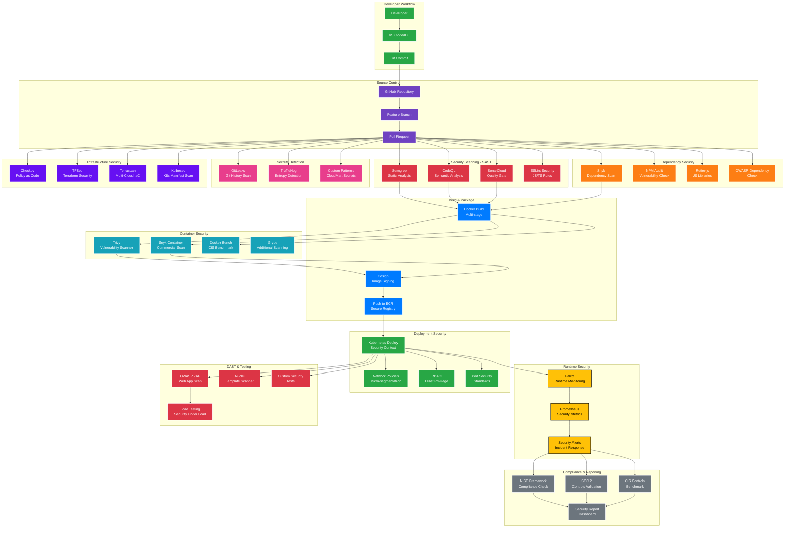
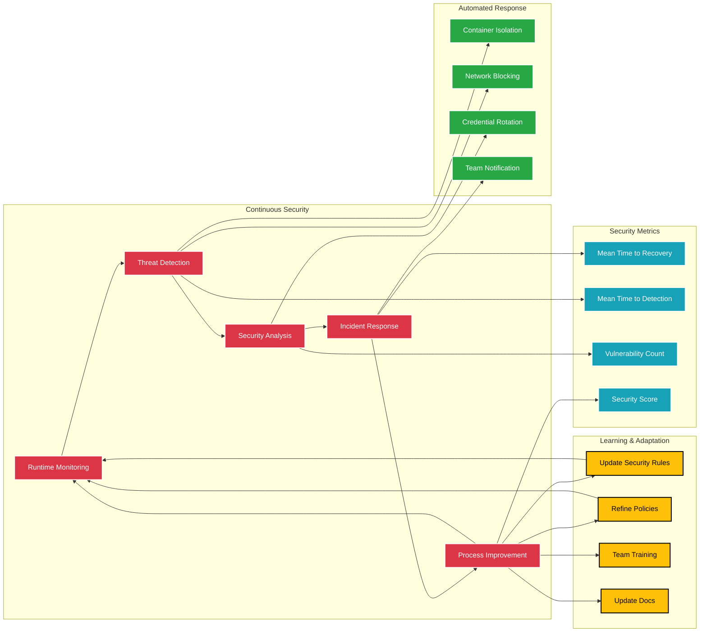

# CloudMart DevSecOps Pipeline

## 🔒 **Security-First CI/CD Pipeline**



## 🚀 **Deployment Pipeline Flow**

```mermaid
gitgraph
    commit id: "Initial Commit"
    branch develop
    checkout develop
    commit id: "Feature Development"
    commit id: "Security Scans Pass"
    
    branch feature/security-enhancement
    checkout feature/security-enhancement
    commit id: "Add SAST Rules"
    commit id: "Container Hardening"
    commit id: "Security Tests"
    
    checkout develop
    merge feature/security-enhancement
    commit id: "Integration Tests"
    
    checkout main
    merge develop
    commit id: "Production Deploy"
    commit id: "Security Monitoring"
    
    branch hotfix/security-patch
    checkout hotfix/security-patch
    commit id: "Critical Security Fix"
    
    checkout main
    merge hotfix/security-patch
    commit id: "Emergency Deploy"
```

## 🔄 **Security Feedback Loop**


