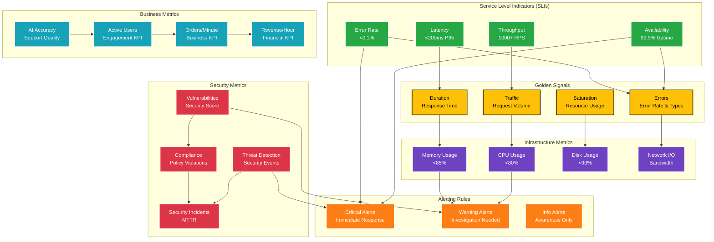
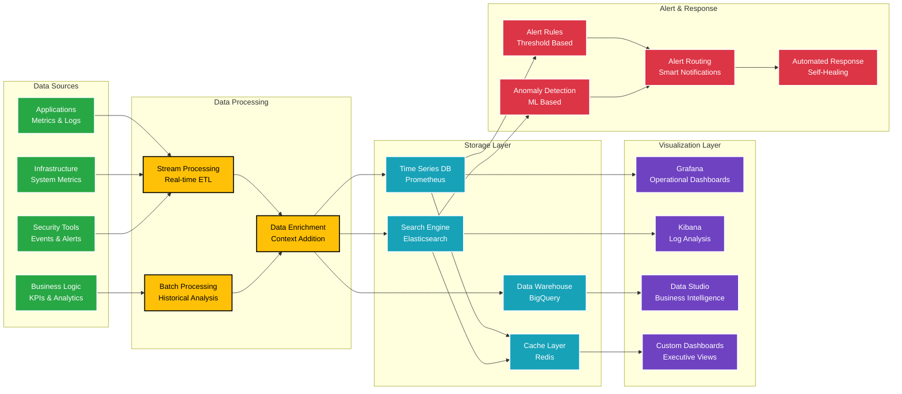
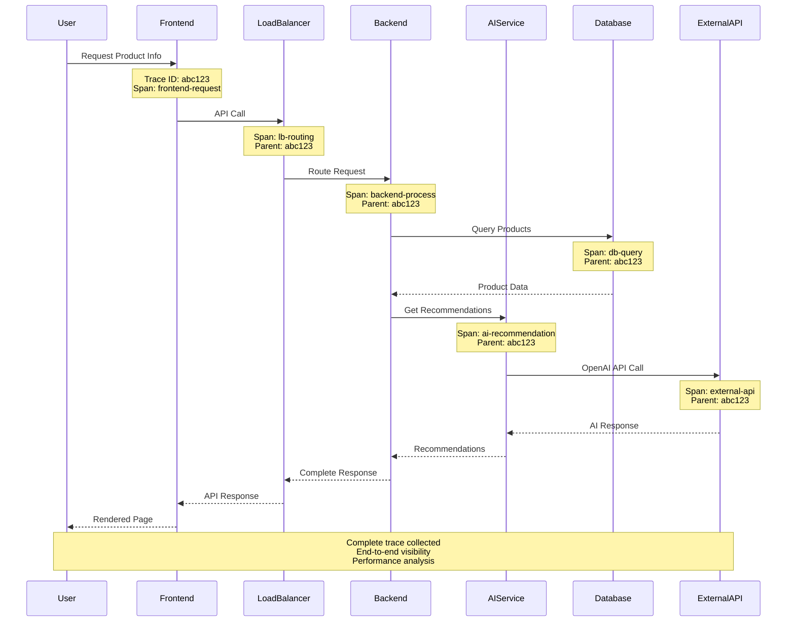

# CloudMart Observability & Monitoring

## 📊 **Comprehensive Observability Stack**

```mermaid
graph TB
    subgraph "Application Layer"
        FE[Frontend<br/>React App]
        BE[Backend<br/>Node.js API]
        AI[AI Services<br/>OpenAI/Bedrock]
        DB[(DynamoDB<br/>Tables)]
    end

    subgraph "Metrics Collection"
        PROM[Prometheus<br/>Metrics Server]
        NODE_EXP[Node Exporter<br/>System Metrics]
        KUBE_METRICS[Kube State Metrics<br/>K8s Resources]
        APP_METRICS[Application Metrics<br/>Custom Metrics]
    end

    subgraph "Logging Pipeline"
        FLUENTD[Fluentd<br/>Log Collector]
        ELASTIC[Elasticsearch<br/>Log Storage]
        KIBANA[Kibana<br/>Log Analysis]
        CLOUDWATCH[CloudWatch<br/>AWS Logs]
    end

    subgraph "Distributed Tracing"
        JAEGER[Jaeger<br/>Trace Collection]
        JAEGER_AGENT[Jaeger Agent<br/>Sidecar]
        JAEGER_COLLECTOR[Jaeger Collector<br/>Trace Processing]
        JAEGER_QUERY[Jaeger Query<br/>Trace UI]
    end

    subgraph "Visualization & Alerting"
        GRAFANA[Grafana<br/>Dashboards]
        ALERT_MGR[AlertManager<br/>Alert Routing]
        PAGERDUTY[PagerDuty<br/>Incident Management]
        SLACK[Slack<br/>Notifications]
    end

    subgraph "Security Monitoring"
        FALCO[Falco<br/>Runtime Security]
        SECURITY_DASH[Security Dashboard<br/>Threat Detection]
        SIEM[SIEM Integration<br/>Security Analytics]
    end

    subgraph "Business Intelligence"
        BIGQUERY[BigQuery<br/>Data Warehouse]
        DATA_STUDIO[Data Studio<br/>Business Dashboards]
        ML_INSIGHTS[ML Insights<br/>Predictive Analytics]
    end

    %% Application to Metrics
    FE --> APP_METRICS
    BE --> APP_METRICS
    AI --> APP_METRICS
    DB --> CLOUDWATCH

    %% Metrics Collection
    APP_METRICS --> PROM
    NODE_EXP --> PROM
    KUBE_METRICS --> PROM

    %% Logging Flow
    FE --> FLUENTD
    BE --> FLUENTD
    AI --> FLUENTD
    FLUENTD --> ELASTIC
    FLUENTD --> CLOUDWATCH
    ELASTIC --> KIBANA

    %% Tracing Flow
    BE --> JAEGER_AGENT
    AI --> JAEGER_AGENT
    JAEGER_AGENT --> JAEGER_COLLECTOR
    JAEGER_COLLECTOR --> JAEGER
    JAEGER --> JAEGER_QUERY

    %% Visualization
    PROM --> GRAFANA
    JAEGER --> GRAFANA
    ELASTIC --> GRAFANA

    %% Alerting
    PROM --> ALERT_MGR
    ALERT_MGR --> PAGERDUTY
    ALERT_MGR --> SLACK

    %% Security Monitoring
    BE --> FALCO
    AI --> FALCO
    FALCO --> SECURITY_DASH
    SECURITY_DASH --> SIEM

    %% Business Intelligence
    DB --> BIGQUERY
    BIGQUERY --> DATA_STUDIO
    BIGQUERY --> ML_INSIGHTS

    %% Styling
    classDef app fill:#61DAFB,stroke:#000,stroke-width:2px,color:#000
    classDef metrics fill:#E6522C,stroke:#fff,stroke-width:2px,color:#fff
    classDef logging fill:#005571,stroke:#fff,stroke-width:2px,color:#fff
    classDef tracing fill:#60D394,stroke:#000,stroke-width:2px,color:#000
    classDef viz fill:#F46800,stroke:#fff,stroke-width:2px,color:#fff
    classDef security fill:#DC3545,stroke:#fff,stroke-width:2px,color:#fff
    classDef bi fill:#4285F4,stroke:#fff,stroke-width:2px,color:#fff

    class FE,BE,AI,DB app
    class PROM,NODE_EXP,KUBE_METRICS,APP_METRICS metrics
    class FLUENTD,ELASTIC,KIBANA,CLOUDWATCH logging
    class JAEGER,JAEGER_AGENT,JAEGER_COLLECTOR,JAEGER_QUERY tracing
    class GRAFANA,ALERT_MGR,PAGERDUTY,SLACK viz
    class FALCO,SECURITY_DASH,SIEM security
    class BIGQUERY,DATA_STUDIO,ML_INSIGHTS bi
```

## 🎯 **Monitoring Strategy & SLIs/SLOs**

## 📈 **Real-Time Dashboard Architecture**

## 🔍 **Distributed Tracing Flow**

